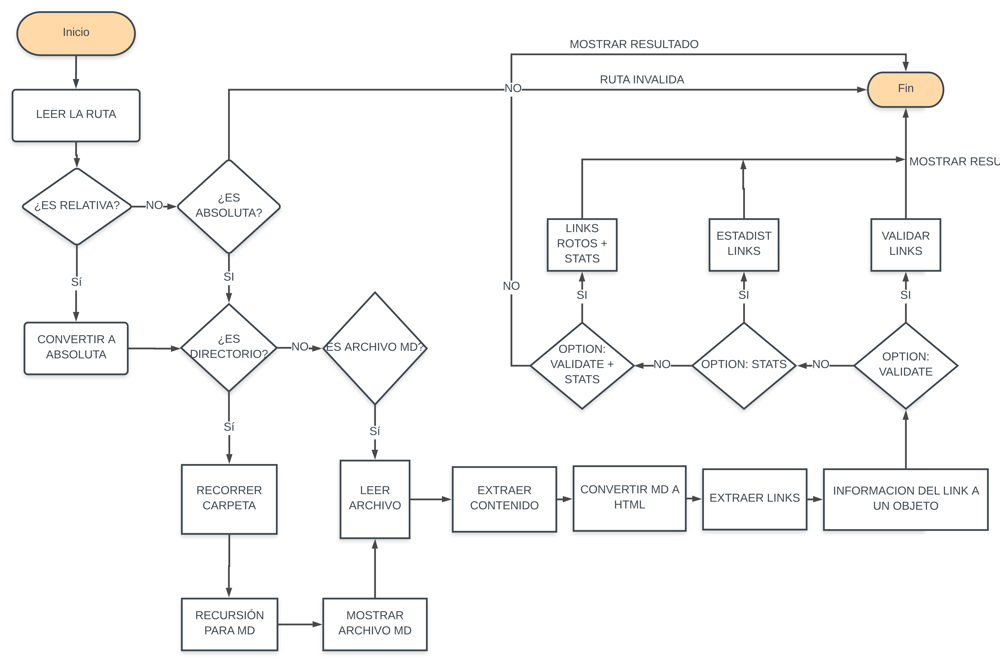

# Markdown Links

## Información

Md-Links es una librería o herramienta creada con node.Js, que sirve a developers u usuarios en general, que tengan el sencillo acceso a determinados archivos de su sistema a través de la consola y extraer los links Markdown que contengan, y reportar algunas estadísticas, usando una línea de comandos.

## Guía de uso o instalación

Ejecute el siguiente comando para instalar la librería:

npm install yenniferh-mdlinks

## Uso de linea de comandos

`md-links 'path-to-file' options`

- path-to-file : es la ruta que vas a pasar a través de consola.
- options : 
      - --validate : el módulo hace una petición HTTP para
averiguar si el link funciona o no. Si el link resulta en una redirección a una URL que responde ok, entonces consideraremos el link como ok.

Por ejemplo:

```sh
$ yenniferh-mdlinks ./some/example.md --validate
./some/example.md http://algo.com/2/3/ ok 200 Link a algo
./some/example.md https://otra-cosa.net/algun-doc.html fail 404 algún doc
./some/example.md http://google.com/ ok 301 Google
```

Vemos que el _output_ en este caso incluye la palabra `ok` o `fail` después de
la URL, así como el status de la respuesta recibida a la petición HTTP a dicha
URL.

   - options:
      - --stats

Si pasamos la opción `--stats` el output (salida) será un texto con estadísticas
básicas sobre los links.

```sh
$ md-links ./some/example.md --stats
Total: 3
Unique: 3
```

También podemos combinar `--stats` y `--validate` para obtener estadísticas que
necesiten de los resultados de la validación.

```sh
$ md-links ./some/example.md --stats --validate
Total: 3
Unique: 3
Broken: 1
```


## Implementación de la librería


## Documentación técnica de la librería

### Diagrama de flujo

Análisis del proceso e información de cada punto de ejecución que se considero en la librería.



#### 


### `README.md`

- [ ] Colocar el *pseudo codigo* o *diagrama de flujo* con el algoritmo que
  soluciona el problema.
- [ ] Un board con el backlog para la implementación de la librería.
- [ ] Documentación técnica de la librería.
- [ ] Guía de uso e instalación de la librería

### API `mdLinks(path, opts)`

- [ ] El módulo exporta una función con la interfaz (API) esperada.
- [ ] Implementa soporte para archivo individual
- [ ] Implementa soporte para directorios
- [ ] Implementa `options.validate`

### CLI

- [ ] Expone ejecutable `md-links` en el path (configurado en `package.json`)
- [ ] Se ejecuta sin errores / output esperado
- [ ] Implementa `--validate`
- [ ] Implementa `--stats`

### Pruebas / tests

- [ ] Pruebas unitarias cubren un mínimo del 70% de statements, functions,
  lines, y branches.
- [ ] Pasa tests (y linters) (`npm test`).

